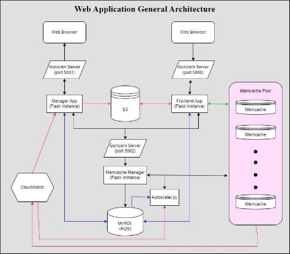
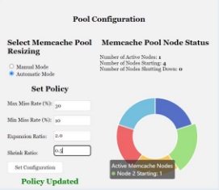
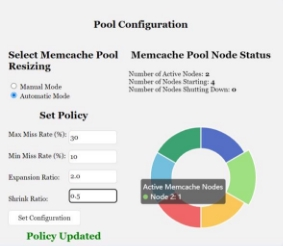
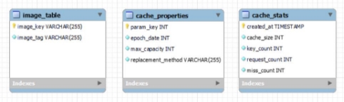

** Contributors :Ruchita Rajkumar Bhadre -  Sneha Prem Kiron -**  

**

**Application Architecture**  

The system architecture consists of three Flask instances, one for frontend, one for the manager app and the last one for handling memory-cache pool actions. The third Flask instance allows decoupling of the pool management from both systems and lifecycle functions of the EC2 instances. The manager app handles configuring the policy. While the memory cache manager handles the execution of the configuration policies and activities involving any kind of communication among the pool of memcache nodes. Similarly, the startup and shutdown of instances is handled by the autoscaler python application that communicates with the manager app and hence helps in ensuring that the manager is always aware of the instance changes. The number of available nodes and correct hash map is determined by the front-end application with the help of the Manager app. 

Along with this fundamental architecture, other cloud services offered by Amazon are also used to enhance this web application. S3 is used to store the image files and fetch them by the front end. These files can be cleared by the manager app. RDS is used by all 4 key components – autoscaler, storing the image data, which is a mapping between keys and image files, storing cache configuration properties, cache pool configurations. For monitoring the system performance, CloudWatch is used and the logs from CloudWatch are used instead of metrics. Lastly, a significant part of the architecture involves the division of services into different components and utility files. Then common components were associated using Flask Blueprints, which helped make the code more structured, and allowed for easier understanding of connected components.  

**New UI**  

|**Application Notification UI** |**Application Memcache Manager App UI** |
| - | - |
|||
|**Active Memcache Node- Starting** |**Active Memcache Node- Started** |
|||

**Design Decisions**

Some of the design decisions we made for our web application are: 

- We used a third Flask instance on top of the 2 required Flask instances, to handle memory-cache pool actions. This was the decided approach to allow decoupling of the pool management from both systems, as well as the lifecycle functions for the EC2 instances. 
- We used logging as a replacement to metrics and used CloudWatch for monitoring system performance. 
- Decomposing services into different components and utility files was a key component of our design. Then, to assist organize the code and make connected components easier to grasp, common components were linked together using Flask Blueprints. 

**Database Schema** 

**Image\_table:** Relational table to store the key and value pairs that are used to determine correlating images in the S3 bucket image-bucket-a2. Image\_key is the primary key for this table.** 

**Cache\_properties:** Relational table to store the configuration parameters for all the memory cache instances. Each entry has param\_key (primary key), update time, max capacity, and replacement method. 

**Cache\_policy:** Relational table to store the policies the auto-scaler will follow to scale the size of the memory cache by starting and stopping instances. Each row has the following parameters: param\_key (primary key), max miss rate to scale up, min miss rate to scale down, expansion ratio- the ratio at which we scale up the instances and shrink ratio- the ratio at which we scale down the instances.

**Graphs** 

||**Constant memcache node pool size latency graph.** |**Constant memcache node pool size throughput graph.** |
| :- | :-: | :-: |
||||
||||
||**Shrinking memcache node pool size latency graph** |**Shrinking memcache node pool size throughput graph.** |
||||
||||

|**Growing memcache node pool size latency graph.** |**Growing memcache node pool size throughput graph.** |
| :-: | :-: |
|||

**Automatic Auto-Scalar Analysis** 

To validate the results of the auto-scaler, we conducted multiple tests to ensure that scaling of the system matched expected behavior. The first style of test conducted involved a full pool increase, followed by a full system decrease. The test case demonstrated below shows the ramp up from 1 memory cache within the pool, up to all 8. This was done using a 2.0 increase factor rate, allowing the system to scale in this order: 1, 2, 4, 8. This was done by trying to access keys that have not been in the cache yet resulting in a 100% miss rate. After this the system was automatically shrunk back down. This was done with a 0.5 shrinking factor, resulting in the system down-scaling in the following order: 8, 4, 2, 1 by leaving the system in an idle state for a few minutes. 

Growing phase- The miss rate spikes to 100%, surpassing the max miss rate threshold, result in the 2 times factor being applied, and 2 more nodes starting as a result. The pool size graph also increases to show this change as well.  

Cooldown phase- To demonstrate the pool size shrinking due to lack of use. The miss rate stays at 0, and the pool shrinks multiple times until only 1 instance is left. 0% miss rate for the most recent point in time. 

The subsequent graphs show results of the process. 

|**Case: growing number of nodes** ||**Case: shrinking number of nodes** |
| - | :- | - |
|**Average Cache Pool Size** ||**Average Cache Pool Size** |
||||
||||
|**Average Miss Rate Threshold** ||**Average Miss Rate Threshold** |
||||
||||
|**Miss rate vs. Number of nodes** ||` `**Miss rate vs. Number of nodes** |
||||
||||
